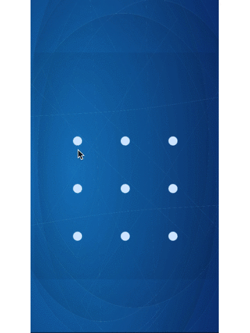

# 基于HTML5 Canvas的解锁图案

### 效果图


### 举个例子

```
<!DOCTYPE HTML>
<html manifest="" lang="en-US">
    <head>
        <meta charset="UTF-8">

        <style type="text/css">
            html, body {
                height: 100%;
                background-color: #FFFFFF
            }
        </style>
        <script src="./PatternToTrace.js" type="text/javascript"></script>
    </head>
    <body>
        <canvas id="ptt" width="400" height="400"></canvas>
        <script type="text/javascript">
            gesture('ptt', function(pwd, error, reset){
                error();

                setTimeout(function(){
                    reset();
                }, 3000);
            });
        </script>
    </body>
</html>
```
